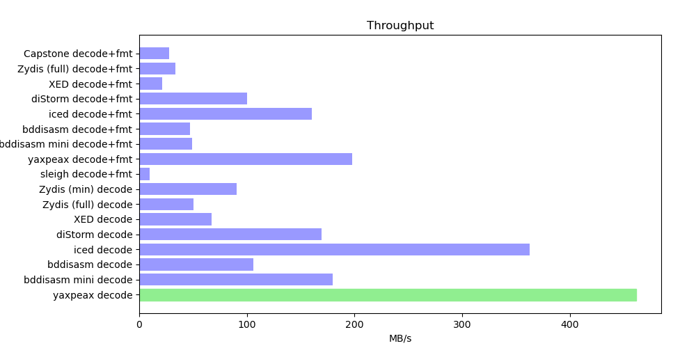

Disassembler Benchmark
======================

This repository holds benchmarking code for various x86/x86-64 disassembler libraries.

## Results


Ubuntu 24.04, Linux 6.8.0, GCC 13.3, rustc 1.88.0, Ryzen 9 9950X

## Candidates

[Capstone](https://github.com/aquynh/capstone)

[DiStorm](https://github.com/gdabah/distorm)

[Intel XED](https://github.com/intelxed/xed)

[Zydis](https://github.com/zyantific/zydis)

[iced](https://github.com/icedland/iced)

[bddisasm](https://github.com/bitdefender/bddisasm)

[yaxpeax-x86](https://github.com/iximeow/yaxpeax-x86)

[Sleigh](https://github.com/lifting-bits/sleigh)

## Benchmarking

Windows:

```cmd
REM Start "x64 Native Tools Command Prompt for VS 2019"
REM Start git bash:
"C:\Program Files\Git\bin\bash.exe"
```

Windows/Linux/macOS:

```bash
git clone --recursive 'https://github.com/athre0z/disas-bench.git'
cd disas-bench.git
./make-all.sh
# Windows: python
python3 -mvenv venv
# Windows: source venv/Scripts/activate
source venv/bin/activate
pip install -r requirements.txt
# Optional args: <code-offset> <code-len> <filename> [loop-count]
# macOS/Windows: python bench.py
LD_LIBRARY_PATH=$(pwd)/bench/distorm python bench.py
```

The optional `bench.py` arguments are:

- `<code-offset>` = offset of the code section (in decimal or 0x hex)
- `<code-len>` = length of the code section (in decimal or 0x hex)
- `<filename>` = 64-bit x86 binary file to decode and format
- `[loop-count]` = optional loop count. Total number of bytes decoded and formatted is `<code-len> * [loop-count]`

## Contributing
If you feel like the benchmark for a lib doesn't drive it to its full potential or treats it unfairly, I'd be happy to accept PRs with improvements!
